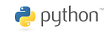
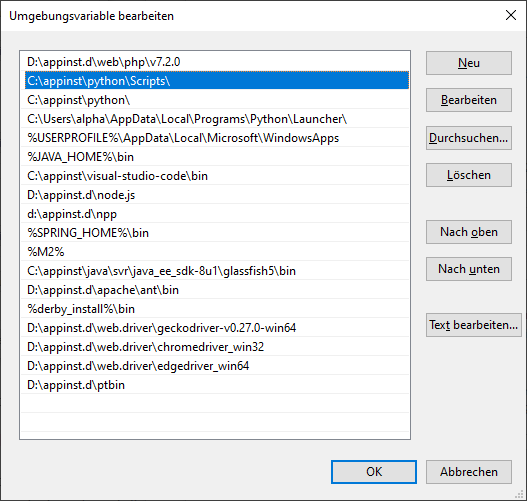
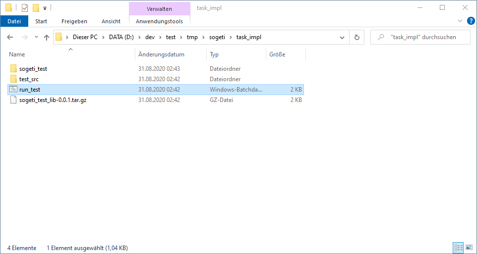
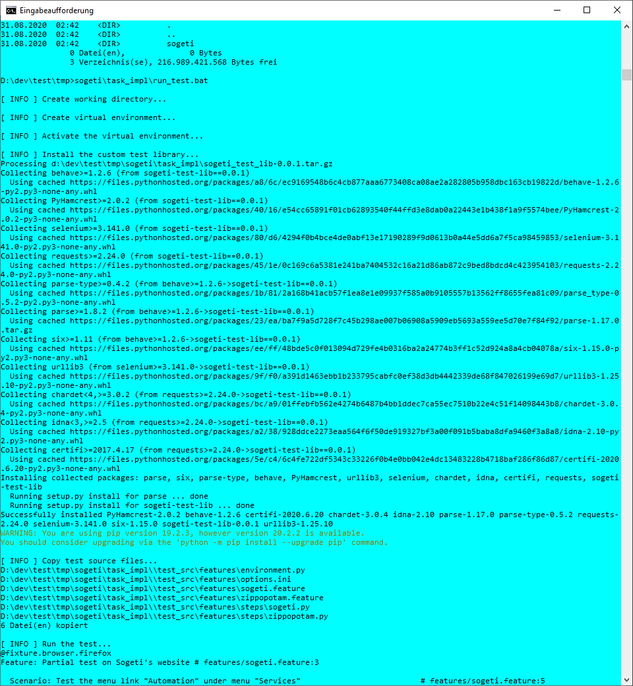
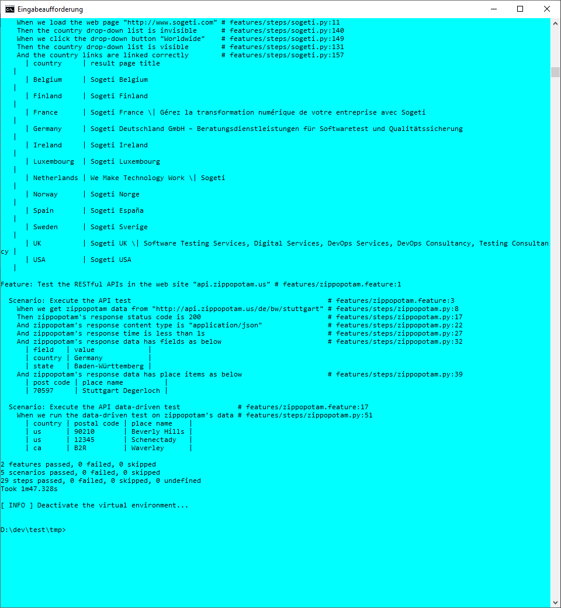

# Solution to Sogeti Interview Task #

## Introduction ##

This project is a solution to the interview task by Sogeti.

## Environment ##

This solution runs under Windows 10. 

It could run in Linux, but need additional configuration and verification. The installation steps differ as well.

## Prerequisites ##

Python should be installed. 

Mozilla Firefox should be installed. 

*Note: Google Chrome and Microsoft Edge haven been tried. But additional configuration and debugging are needed to finish with them.*

You should have the network connection.

In some companies, the __network/firewall__ settings may forbid downloading Python libaries via the tool `"pip"`. If this is true, please consult your IT administrator/specialist, for example, to download those libaries manually. 

### Python Libaries ###

* behave, >=1.2.6
* PyHamcrest, >=2.0.2
* selenium, >=3.141.0
* requests, >=2.24.0

The project will try to insall these libaries automatically.

## Installation

### Install Python

If you do not have Python, please install it.

__Attention:__ When Python is installed, please note its installation directory. In this README, this installation directory will be mentioned as __`<python-install-dir>`__ in the following text.

After Python is installed, please add the __absolute__ path to __`<python-install-dir>\Scripts`__ to your environment variable `"PATH"`.

### Install the web driver for Firefox

If you do not have the web driver for Firefox, please follow the following link to install it.

https://github.com/mozilla/geckodriver/releases

After the installation, you need add the __absolute__ path to the web driver's installation directory to your environment variable `"PATH"`. The web driver's installation directory is the folder that contains the file "`geckodriver.exe`".

### Download/Clone this project

You may download the .zip file of this project, or clone it.

`git clone https://github.com/zwhan166/sogeti.git`

## Run the test

The batch script `"sogeti\task_impl\run_this.bat"` is the entry point.

You may double click the batch script `"sogeti\task_impl\run_this.bat"` to run the test.

Or, you may open one Windows console, change directory to `"sogeti\task_impl\"`, and then type `"run_this.bat"` to run it. For example, 

1. Open one Windows console
1. `cd "<cloned-dir>\sogeti\task_impl\"`
2. type `"run_this.bat"`

## What happens with the batch script

The batch script will do the following.

1. Create a working directory
2. Create a Python's virtual environment
3. Activate the virtual environment
4. Install the necessary Python libaries into the virtual environment
5. Run the Behave test.
6. Deactivate the virtual environment

